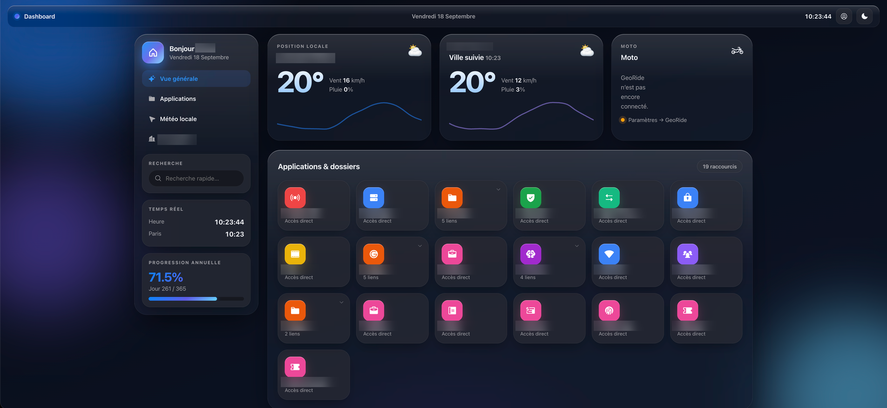
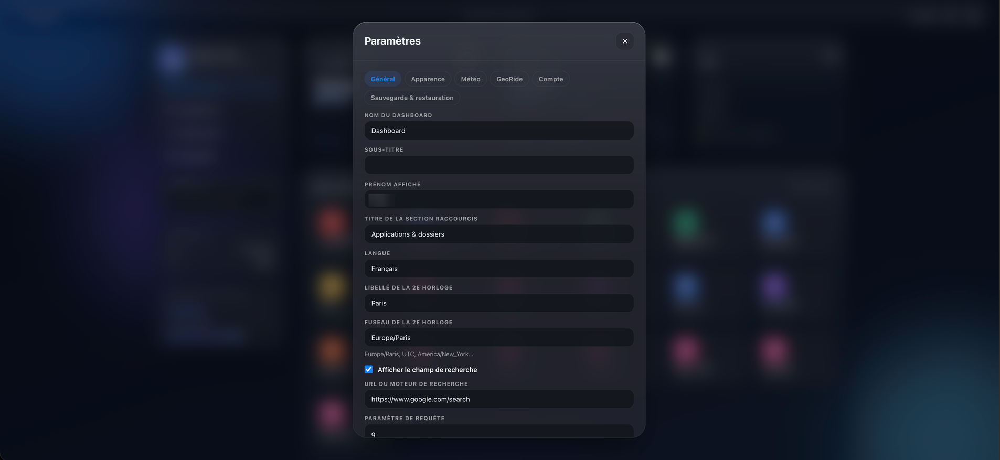
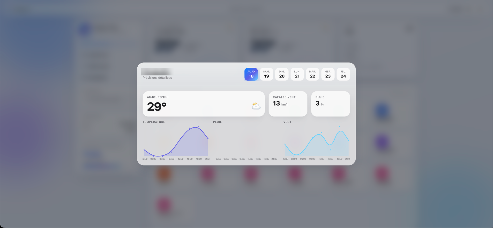
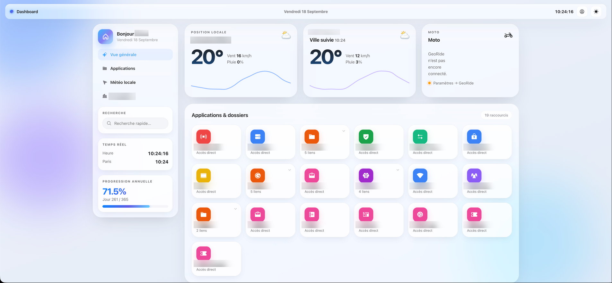

# Glassboard

A self-hosted dashboard for the services you use every day: a grid of shortcuts,
weather tiles and optional integrations, all editable from the page itself,
behind a login with two-factor authentication.



<sub>Screenshots come from a real instance, with the names and places blurred out.</sub>

Glassboard keeps a strict line between **the software** (this repository) and
**your data** (a directory you own). A fresh install starts empty, with a
neutral example configuration, and your whole setup is one JSON file you can
export, version and restore anywhere.

```
┌─────────┐      ┌───────────────┐      ┌──────────────────────────────┐
│ browser │ ───▶ │ Glassboard    │ ───▶ │ SQLite  (your data dir)      │
└─────────┘      │ Node/Express  │ ───▶ │ Open-Meteo / OpenStreetMap   │
                 └───────────────┘ ───▶ │ GeoRide API                  │
                                        └──────────────────────────────┘
```

Every call to a third-party API happens on the server. No API token ever
reaches the browser, and no request goes out to a service you did not enable.

## Features

- **Live editing**: add, edit, reorder, resize and remove tiles and shortcuts
  directly on the page. Folders group shortcuts behind a modal.
- **Server-side configuration**: the same dashboard on every device. Nothing
  lives in browser storage except your light/dark preference.
- **Native authentication**: a two-step sign-in (password, then TOTP) with QR
  enrolment, single-use recovery codes, argon2id hashing, signed `HttpOnly`
  session cookies and a temporary lockout after repeated failures. Only the
  login page is public.
- **Optional integrations**: weather (Open-Meteo) and GeoRide motorcycle
  tracking. A disabled or unconfigured integration never breaks the page. The
  tile explains what is missing, and the rest of the dashboard carries on.
- **Backup and restore**: a single versioned JSON file, from the interface or
  from the command line, with automatic snapshots before every import.
- **Themes and wallpapers**: six colour presets, light and dark, plus your own
  background image with adjustable dimming and blur. Shuffle picks one at
  random and cross-fades the whole page into it. Everything is a CSS variable,
  so a seventh preset is a dozen lines.
- **Built for a phone too**: a thumb-reachable bottom dock, bottom sheets
  instead of centred modals, a four-column grid of shortcuts like a home
  screen, and full support for notches, Dynamic Islands and home indicators.
  Add it to your home screen and it runs as a standalone app.
- **Seven interface languages**: English, French, Spanish, German, Italian,
  Portuguese and Dutch. The dashboard follows the language you pick in the
  settings, the sign-in screens follow the browser.
- **Light footprint**: no front-end framework, no build step, no CDN. Two
  vendored libraries, four runtime dependencies, one SQLite file.

## Requirements

- **Node.js 24 or newer** (uses the built-in `node:sqlite`), or
- **Docker** with Compose.

## Quick start with Docker

```bash
git clone https://github.com/<you>/glassboard.git
cd glassboard
cp .env.example .env
# Generate a secret and put it in .env as APP_SECRET
node -e "console.log(require('crypto').randomBytes(48).toString('hex'))"
docker compose up -d
```

Open <http://localhost:8080> and create your account.

## Quick start without Docker

```bash
git clone https://github.com/<you>/glassboard.git
cd glassboard
npm ci --omit=dev
cp .env.example .env     # then set APP_SECRET
npm start
```

Open <http://localhost:3000>.

## First run

1. `/setup` asks for a username and a password (12 characters minimum). There
   is no default account and no default password.
2. The next screen shows a QR code for your authenticator app: Google
   Authenticator, Aegis, Bitwarden, 1Password, anything that speaks TOTP.
3. You then get ten single-use recovery codes. Save them: any one of them
   replaces the six-digit code if you lose your phone.
4. The dashboard opens with a neutral example configuration. Open the account
   menu (top right), pick **Edit dashboard**, and make it yours.

## Editing

The account menu in the top bar switches between read and edit mode.

| In edit mode | How |
|---|---|
| Move a tile, a shortcut or a folder | drag it where you want it; the others slide out of the way |
| Resize a tile | drag the grip on its right edge |
| Change a shortcut | the pencil button on the card |
| Create a folder | **Add a folder**, then add links inside it |
| Open a folder to edit its links | click it |
| Put a shortcut in a folder | drop it on the middle of the folder, or pick the folder in its **Location** field |
| Take a link out of a folder | set its **Location** back to **Main grid** |
| Add or configure a tile | **Add a tile**, or the gear on an existing one |
| Keep or drop the changes | **Save** / **Cancel** in the bottom bar |

Rearranging works like a phone home screen: the card lifts, follows the pointer,
and the others make room for it as it goes. With a mouse, just drag. With a
finger, hold the card for a moment, then drag; a quick swipe still scrolls the
page. Near the top or the bottom of the screen, the page scrolls along.

Dropping a shortcut on the middle of a folder files it there; its edges only
reorder. Folders only hold shortcuts, so a folder dropped on another one just
moves next to it. Inside an open folder, links rearrange the same way, and a
link released outside the folder goes back to the main grid.

Nothing is written to the server until you press **Save**.

Everything that is not a tile lives in **Settings**, reachable from the same
menu: the dashboard name, the language, the clocks, the search engine, the
integrations, the appearance, the account and the backups.



## Environment variables

| Variable | Default | Purpose |
|---|---|---|
| `APP_SECRET` | none | **Required in production.** Signs sessions and encrypts stored credentials. Changing it invalidates both. |
| `PORT` | `3000` | HTTP port. |
| `HOST` | `127.0.0.1` | Bind address. Use `0.0.0.0` in a container. |
| `DATA_DIR` | `./data` | Where the database, backups and the tile cache live. |
| `TRUST_PROXY` | `0` | Set to `1` behind a reverse proxy so client IPs and the HTTPS flag come from `X-Forwarded-*`. |
| `COOKIE_SECURE` | `auto` | `auto` marks the session cookie `Secure` only on HTTPS requests. Force with `true` / `false`. |
| `SESSION_TTL_HOURS` | `720` | Session lifetime. |
| `LOGIN_MAX_ATTEMPTS` | `5` | Failed logins before a lockout. |
| `LOGIN_LOCKOUT_MINUTES` | `15` | Lockout duration. |
| `OSM_CONTACT` | none | Optional contact address sent to OpenStreetMap services, as their usage policy asks. |

## Integrations

### Weather, Open-Meteo

No account, no API key. Two kinds of tile: one that follows the browser
geolocation (with a configurable fallback position) and one for a fixed city.
City names are resolved through OpenStreetMap Nominatim, server-side and
cached, so your visitors' IP addresses never reach it. Disable the whole
integration in **Settings → Weather** and both tiles disappear cleanly.

Clicking a weather tile opens the detailed forecast: seven days, with
temperature, rain and wind over the hours of the day you pick.



### GeoRide, motorcycle tracker

Sign in once in **Settings → GeoRide**. The credentials are encrypted with
`APP_SECRET` and stored in your data directory, and the returned token is
renewed automatically before it expires. The tile shows the distance, riding
time, number of trips and top speed over the period you choose, plus the
current position on a map.

Endpoints used, from the official documentation at <https://api.georide.fr>:
`POST /user/login`, `GET /user/new-token`, `GET /user/trackers`,
`GET /tracker/:id/trips`, `GET /tracker/:id/trips/positions`. Speeds are
returned in knots and converted to km/h, distances are in metres.

Map tiles come from OpenStreetMap through the server, and are cached on disk.
If you expect real traffic, point the proxy at your own tile server. See
[OSM's tile usage policy](https://operations.osmfoundation.org/policies/tiles/).

### Adding your own

A tile type is one entry in `TILE_TYPES` (`server/config-schema.js`), one
renderer in `public/assets/app.js`, and, if it talks to an API, one module in
`server/integrations/`. The configuration document carries its settings. No
other part of the system needs to know about it.

## Backup and restore

From the interface: account menu → **Export configuration** / **Import
configuration**, or **Settings → Backup & restore**.

From the command line:

```bash
npm run config:export -- --out backup.json
npm run config:export -- --out backup.json --include-secrets
npm run config:import -- backup.json
```

In Docker:

```bash
docker compose exec glassboard node scripts/config-export.mjs --stdout > backup.json
```

Secrets are **excluded by default**. With `--include-secrets` the file contains
your integration credentials in plain text, carries a `WARNING` field, and is
written with `0600` permissions. Treat it like a password file.

Every import writes a snapshot of the current configuration to
`$DATA_DIR/backups/` first, validates the whole file, and only then replaces
anything. An invalid file is refused with a precise error and changes nothing.

The format is versioned and documented in
[docs/configuration-format.md](docs/configuration-format.md).

## Reverse proxy

```nginx
server {
    listen 443 ssl;
    server_name dashboard.example.org;

    location / {
        proxy_pass http://127.0.0.1:3000;
        proxy_set_header Host              $host;
        proxy_set_header X-Real-IP         $remote_addr;
        proxy_set_header X-Forwarded-For   $proxy_add_x_forwarded_for;
        proxy_set_header X-Forwarded-Proto $scheme;
    }
}
```

Set `TRUST_PROXY=1` so the lockout counts real client addresses.

## What lives where

```
glassboard/
├── server/            HTTP server, storage, auth, integrations
├── public/            the dashboard itself (HTML/CSS/JS, no build)
├── scripts/           export and import CLI
├── docs/              format documentation
└── $DATA_DIR/         YOUR data, never in git
    ├── glassboard.db  configuration, account, encrypted credentials
    ├── backups/       automatic snapshots taken before imports
    └── tiles/         cached map tiles
```

## Security notes

- Passwords are hashed with argon2id. TOTP secrets and integration credentials
  are encrypted with AES-256-GCM.
- Session cookies are `HttpOnly`, `SameSite=Lax`, and `Secure` over HTTPS.
- Signing in takes two steps. A correct password opens no session: it issues a
  single-use challenge, valid five minutes, that grants nothing but the right to
  present a second factor for that one account. Both steps share the same
  lockout counter, so the code step cannot be brute-forced either.
- Every page and every API route requires a session, except the login and
  first-run setup screens.
- Shortcut URLs are restricted to `http:` and `https:`, in the browser and on
  the server, so an imported file cannot inject a `javascript:` link.
- Losing `APP_SECRET` means losing the sessions and the stored credentials. The
  dashboard configuration itself stays readable.

## Housekeeping

An hourly job keeps the footprint flat without any attention: it drops expired
cache rows and caps the table, deletes expired sessions and sign-in challenges,
trims the map tile cache back under 128 MB by dropping the least recently used,
folds SQLite's write-ahead log back into the database and refreshes its
statistics.

In the browser, the clock and the polling stop while the tab is hidden and pick
up again when it comes back. A dashboard left open on a phone all day should
not cost battery.

## Themes and wallpaper

**Settings → Appearance** holds six presets: Glass blue (the default), Ember,
Forest, Violet, Rose and Slate. Each one drives the accent colour, the glow, the
animated background orbs and the backdrop, in both light and dark mode. Choices
preview live on the real dashboard, and nothing is written until you save.

You can also upload your own background: PNG, JPEG, WebP or GIF, up to 4 MB.
The image is stored in your data directory, served only to authenticated
sessions, and identified by its magic bytes rather than by its declared type.
Two sliders control how much the image is dimmed and blurred, so the glass
surfaces stay readable over any photograph, and the orbs can be switched off.

The wallpaper travels inside the configuration export, so restoring on a blank
instance gives back the same dashboard, image included. An image larger than
4 MB is left out and flagged in the file rather than silently dropped.

A new preset is one block in `public/assets/themes.css` plus one entry in
`THEME_PRESETS` (`server/config-schema.js`).



## On a phone

Below 820 px the layout changes rather than shrinks:

- the page is reordered for a thumb: greeting and search, the tiles, the
  shortcuts, and the clock and year cards last;
- navigation moves to a **bottom dock**, where a thumb reaches it; while
  editing, the **Save** / **Cancel** bar takes its place;
- weather tiles pair up side by side, other tiles keep the full width;
- shortcuts become a four-column home screen grid (three below 360 px), with
  one-line labels, and hover effects are disabled so no card stays stuck
  highlighted after a tap;
- modals become **bottom sheets** with a grab handle, their **Save** button
  stays pinned at the bottom, the settings tabs scroll sideways and the seven
  forecast days fit on one line;
- `viewport-fit=cover` plus `env(safe-area-inset-*)` keep the bars clear of a
  notch, a Dynamic Island, a home indicator and curved screen edges;
- the status bar takes the colour of the current theme.

A web manifest ships with the app, so **Add to Home Screen** gives a standalone
window with no browser chrome, on both Android and iOS.

Backdrop blur is the expensive part of this design on a phone GPU, so it is
lightened on small screens, one of the background orbs is dropped, and the
parallax runs only on a device with a real pointer.

## Languages

The interface ships in **English (`en`), French (`fr`), Spanish (`es`), German
(`de`), Italian (`it`), Portuguese (`pt`) and Dutch (`nl`)**. Pick one in
**Settings → General → Language**, it also drives date and time formatting. The
login and first-run screens run before any configuration exists, so they follow
the browser's preferred language instead.

Adding a language is one file: in `public/assets/i18n.js`, add an entry to
`LOCALE_NAMES` and copy the `en` table. Missing keys fall back to English one by
one, so a partial translation is perfectly usable and no key ever shows up raw.

## Credits

- [Phosphor Icons](https://phosphoricons.com) (MIT), inlined SVG icons
- [Leaflet](https://leafletjs.com) (BSD-2-Clause), map rendering
- [Open-Meteo](https://open-meteo.com), weather forecasts
- [OpenStreetMap](https://www.openstreetmap.org/copyright), map tiles and
  reverse geocoding
- [GeoRide](https://georide.fr), tracker API

## License

MIT, see [LICENSE](LICENSE).
