# Glassboard


A self-hosted dashboard for the services you use every day: a grid of shortcuts,
weather tiles and optional integrations, all editable from the page itself,
behind a login with two-factor authentication.

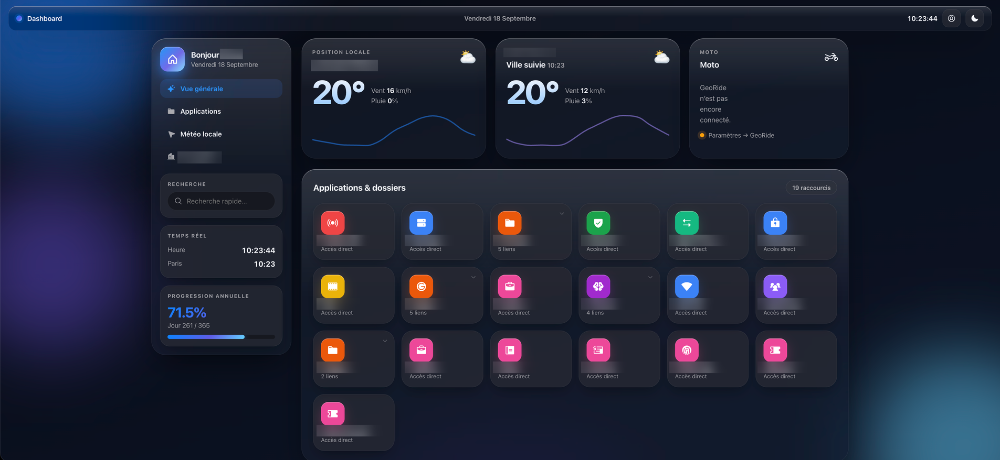

<sub>Screenshots come either from a real instance with the names and places
blurred out, or from a demo instance holding nothing but invented data. There is
no public demo: Glassboard is meant to run on your own machine.</sub>

Glassboard keeps a strict line between **the software** (this repository) and
**your data** (a directory you own). A fresh install starts empty, with a
neutral example configuration, and your whole setup is one JSON file you can
export, version and restore anywhere.

```
┌─────────┐      ┌───────────────┐      ┌──────────────────────────────┐
│ browser │ ───▶ │ Glassboard    │ ───▶ │ SQLite  (your data dir)      │
└─────────┘      │ Node/Express  │ ───▶ │ Open-Meteo / OpenStreetMap   │
                 │               │ ───▶ │ GeoRide API                  │
                 │               │ ───▶ │ 17TRACK API                  │
                 └───────────────┘ ───▶ │ your IMAP mailbox, read-only │
                                        └──────────────────────────────┘
```

Every call to a third-party API happens on the server. No API token ever
reaches the browser, and no request goes out to a service you did not enable.

## Contents

- [Features](#features)
- [Requirements](#requirements)
- [Install](#install) — [Docker](#with-docker), [without Docker](#without-docker), [as a service](#as-a-system-service)
- [First run](#first-run)
- [Updating](#updating)
- [Using Glassboard](#using-glassboard) — [editing](#editing-the-dashboard), [settings](#settings), [themes](#themes-and-wallpaper), [on a phone](#on-a-phone), [installing it as an app](#installing-it-as-an-app), [languages](#languages)
- [Signing in](#signing-in) — [with your phone](#signing-in-with-your-phone), [open sessions](#open-sessions)
- [Accounts](#accounts) — [adding someone](#adding-someone), [the administrator](#the-administrator), [sending invitations](#sending-invitations)
- [Integrations](#integrations)
- [Backup and restore](#backup-and-restore)
- [Behind a reverse proxy](#behind-a-reverse-proxy)
- [Configuration reference](#configuration-reference)
- [Security](#security)
- [How it works](#how-it-works)
- [Contributing](#contributing)
- [Credits](#credits) and [licence](#license)

## Features

- **Live editing**: add, edit, reorder, resize and remove tiles and shortcuts
  directly on the page. Folders group shortcuts behind a modal.
- **Server-side configuration**: the same dashboard on every device. Nothing
  lives in browser storage except your light/dark preference.
- **Several accounts, each with its own dashboard**: shortcuts, tiles,
  wallpaper, revision history, parcels and integration credentials are all per
  account, and nobody sees anyone else's. The first account created is the
  instance's administrator, and can hand that role to anyone else.
- **Native authentication**: a two-step sign-in (password, then TOTP) with QR
  enrolment, single-use recovery codes, argon2id hashing, signed `HttpOnly`
  session cookies and a temporary lockout after repeated failures. Only the
  sign-in screens are public, and they hold nothing.
- **Sign in by scanning a code**: on a screen that holds none of your
  credentials, show a QR code and approve it from a phone that is already
  signed in. The approving device is told which browser is asking, from which
  address and how long ago, and both screens show the same short code to
  compare. Settings list every open session, how each was opened and when it
  was last used, with a button to end any of them.
- **Optional integrations**: weather (Open-Meteo), parcel tracking (17TRACK) and
  GeoRide motorcycle tracking. Each tile opens a detail view: seven days of
  forecast, the steps a parcel has been through, or the rides of the period on
  an interactive map. A disabled or unconfigured integration never breaks the
  page. The tile explains what is missing, and the rest of the dashboard carries
  on.
- **Backup and restore**: a single versioned JSON file, from the interface or
  from the command line, with automatic snapshots before every import.
- **Themes and wallpapers**: six colour presets, light and dark, plus your own
  background image with adjustable dimming and blur. Shuffle picks one at
  random and cross-fades the whole page into it. Everything is a CSS variable,
  so a seventh preset is a dozen lines.
- **Built for a phone too**: a thumb-reachable bottom dock, bottom sheets
  instead of centred modals, a four-column grid of shortcuts like a home
  screen, and full support for notches, Dynamic Islands and home indicators.
  Add it to your home screen and it runs as a standalone app.
- **Seven interface languages**: English, French, Spanish, German, Italian,
  Portuguese and Dutch. The dashboard follows the language you pick in the
  settings, the sign-in screens follow the browser.
- **Installable**: a Progressive Web App, with its own window and icon on a
  phone or a computer.
- **Light footprint**: no front-end framework, no build step, no CDN. Two
  vendored libraries, four runtime dependencies, one SQLite file.

## Requirements

- **Node.js 24 or newer** (it uses the built-in `node:sqlite`, so there is no
  native module to compile), **or**
- **Docker** with Compose.

Nothing else: no database server, no build tool chain, no CDN.

## Install

### With Docker

```bash
git clone https://github.com/Lokyron/GlassBoard.git
cd GlassBoard
cp .env.example .env
# Generate a secret and put it in .env as APP_SECRET
node -e "console.log(require('crypto').randomBytes(48).toString('hex'))"
docker compose up -d
```

Open <http://localhost:8080>. Your data lives in the `glassboard-data` volume,
never in the image, so rebuilding never touches it.

### Without Docker

```bash
git clone https://github.com/Lokyron/GlassBoard.git
cd GlassBoard
npm ci --omit=dev
cp .env.example .env     # then set APP_SECRET
npm start
```

Open <http://localhost:3000>.

### As a system service

On a server, run it as its own user behind a reverse proxy. A minimal unit:

```ini
[Unit]
Description=Glassboard dashboard
After=network.target

[Service]
User=glassboard
WorkingDirectory=/opt/glassboard
EnvironmentFile=/opt/glassboard/.env
ExecStart=/usr/bin/node server/index.js
Restart=on-failure

# Keep the service away from everything but its own data.
NoNewPrivileges=yes
PrivateTmp=yes
ProtectSystem=strict
ProtectHome=yes
ReadWritePaths=/var/lib/glassboard

[Install]
WantedBy=multi-user.target
```

With `DATA_DIR=/var/lib/glassboard` in the `.env`, and `HOST=127.0.0.1` so only
the proxy can reach it.

## First run

1. `/setup` asks for a username and a password (12 characters minimum). There
   is no default account and no default password.
2. The next screen shows a QR code for your authenticator app: Google
   Authenticator, Aegis, Bitwarden, 1Password, anything that speaks TOTP.
3. You then get ten single-use recovery codes. Save them: any one of them
   replaces the six-digit code if you lose your phone.
4. The dashboard opens with a neutral example configuration. Open the account
   menu (top right), pick **Edit dashboard**, and make it yours.

The first account created is the instance's **administrator**. It is the only
one that can add other accounts, and it can hand that role to someone else
later. See [Accounts](#accounts).

## Updating

Glassboard has no database migrations to run: new tables and columns are created
at start-up, and a configuration written by an older version is completed with
the fields it lacks the first time it is read. Still, take a backup first, from
the account menu or with `npm run config:export`.

```bash
# Docker
git pull && docker compose up -d --build

# Without Docker
git pull && npm ci --omit=dev && systemctl restart glassboard
```

An installed app picks the new version up on its own: the service worker and the
manifest are always served fresh.

The first time you open the dashboard on a version you have not seen, a dialog
says what changed. It is read straight out of [CHANGELOG.md](CHANGELOG.md), so
there is never a second list of changes to keep in step with the first, and it
is acknowledged per account — your dismissing it does not dismiss it for anyone
else. **Settings → About** has a **What's new** button to open it again. The
notes are in English, like this file; the dialog around them follows your
language and says so.

### From inside Glassboard

Glassboard can also update itself, from **Settings → About**: it shows the
installed version, what the repository has, and an **Update now** button, with a
dot next to the account button when a newer version is waiting.

The application never writes its own code. Pressing the button drops a request
file in the data directory; a systemd path unit runs the updater as root, which
downloads the new version, installs it, restarts the service, and rolls back if
it fails to start. Setting it up takes three commands, in
[deploy/README.md](deploy/README.md).

Two channels are offered there: **stable**, which follows the main branch, and
**beta**, which follows a branch meant for trying a change out first. Switching
between them installs that branch, in either direction, so going back to stable
is one click. The request file names a channel and never a branch: turning a
channel into a branch is the updater's job, from its own unit file, so the web
application cannot point it at a ref of its choosing.

## Using Glassboard

### Editing the dashboard

The account menu in the top bar switches between read and edit mode.

| In edit mode | How |
|---|---|
| Move a tile, a shortcut or a folder | drag it where you want it; the others slide out of the way |
| Resize a tile | drag the grip on its right edge |
| Change a shortcut | the pencil button on the card |
| Create a folder | **Add a folder**, then add links inside it |
| Open a folder to edit its links | click it |
| Put a shortcut in a folder | drop it on the middle of the folder, or pick the folder in its **Location** field |
| Take a link out of a folder | set its **Location** back to **Main grid** |
| Add or configure a tile | **Add a tile**, or the gear on an existing one |
| Keep or drop the changes | **Save** / **Cancel** in the bottom bar |

Rearranging works like a phone home screen: the card lifts, follows the pointer,
and the others make room for it as it goes. With a mouse, just drag. With a
finger, hold the card for a moment, then drag; a quick swipe still scrolls the
page. Near the top or the bottom of the screen, the page scrolls along.

Dropping a shortcut on the middle of a folder files it there; its edges only
reorder. Folders only hold shortcuts, so a folder dropped on another one just
moves next to it. Inside an open folder, links rearrange the same way, and a
link released outside the folder goes back to the main grid.

Nothing is written to the server until you press **Save**.

### Settings

Everything that is not a tile lives in **Settings**, reachable from the same
menu: the dashboard name, the language, the clocks, the search engine, the
integrations, the appearance, the account and the backups.

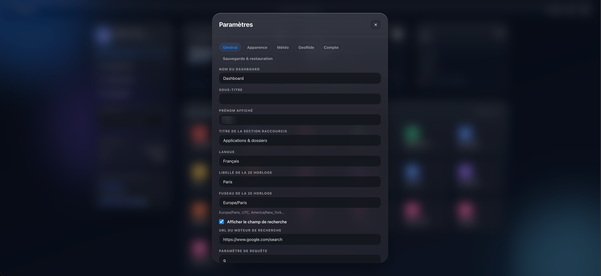

### Themes and wallpaper

**Settings → Appearance** holds six presets: Glass blue (the default), Ember,
Forest, Violet, Rose and Slate. Each one drives the accent colour, the glow, the
animated background orbs and the backdrop, in both light and dark mode. Choices
preview live on the real dashboard, and nothing is written until you save.

You can also upload your own background: PNG, JPEG, WebP or GIF, up to 4 MB.
The image is stored in your data directory, served only to authenticated
sessions, and identified by its magic bytes rather than by its declared type.
Two sliders control how much the image is dimmed and blurred, so the glass
surfaces stay readable over any photograph, and the orbs can be switched off.

The wallpaper travels inside the configuration export, so restoring on a blank
instance gives back the same dashboard, image included. An image larger than
4 MB is left out and flagged in the file rather than silently dropped.

A new preset is one block in `public/assets/themes.css` plus one entry in
`THEME_PRESETS` (`server/config-schema.js`).

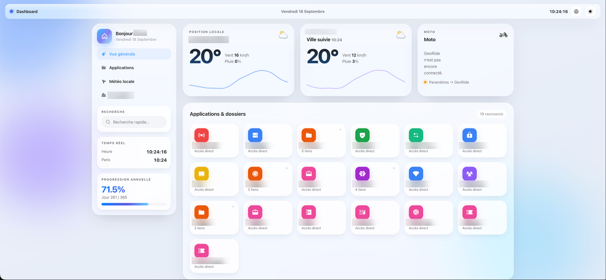

### On a phone

Below 820 px the layout changes rather than shrinks:

- the page is reordered for a thumb: greeting and search, the tiles, the
  shortcuts, and the clock and year cards last;
- navigation moves to a **bottom dock**, where a thumb reaches it; while
  editing, the **Save** / **Cancel** bar takes its place;
- weather tiles pair up side by side, other tiles keep the full width;
- shortcuts become a four-column home screen grid (three below 360 px), with
  one-line labels, and hover effects are disabled so no card stays stuck
  highlighted after a tap;
- modals become **bottom sheets** with a grab handle, their **Save** button
  stays pinned at the bottom, the settings tabs scroll sideways and the seven
  forecast days fit on one line;
- `viewport-fit=cover` plus `env(safe-area-inset-*)` keep the bars clear of a
  notch, a Dynamic Island, a home indicator and curved screen edges;
- the status bar takes the colour of the current theme.

Backdrop blur is the expensive part of this design on a phone GPU, so it is
lightened on small screens, one of the background orbs is dropped, and the
parallax runs only on a device with a real pointer.

### Installing it as an app

Glassboard is a Progressive Web App: it installs from the browser and then runs
in its own window, with its own icon, like a native app.

- **Chrome, Edge, Android**: use the install icon in the address bar or the
  browser menu, or **Install the app** in Glassboard's account menu.
- **iPhone and iPad**: **Install the app** in the account menu shows the steps:
  Share menu, then **Add to Home Screen**.
- **Safari on a Mac**: **File → Add to Dock**.

The menu entry only appears where the browser can install, and disappears once
you are inside the installed app.

Installing needs **HTTPS**, like every browser feature of this kind. Over plain
`http://` on a LAN address the dashboard works as usual but cannot be
installed; `localhost` is the only exception. The manifest is requested with
credentials, so installing also works behind a proxy that asks for a login
(basic auth, Authelia, Authentik).

A service worker makes the app installable and shows a small offline page when
the server cannot be reached; the page comes back by itself when the connection
does. It never stores your data: API responses and pages are not cached, only
the files the offline page needs.

### Languages

The interface ships in **English (`en`), French (`fr`), Spanish (`es`), German
(`de`), Italian (`it`), Portuguese (`pt`) and Dutch (`nl`)**. Pick one in
**Settings → General → Language**, it also drives date and time formatting. The
login and first-run screens run before any configuration exists, so they follow
the browser's preferred language instead.

Adding a language is one file: in `public/assets/i18n.js`, add an entry to
`LOCALE_NAMES` and copy the `en` table. Missing keys fall back to English one by
one, so a partial translation is perfectly usable and no key ever shows up raw.

## Signing in

The sign-in screen greets you by the hour, shows the date and the time, and
follows the colour preset chosen in the settings.

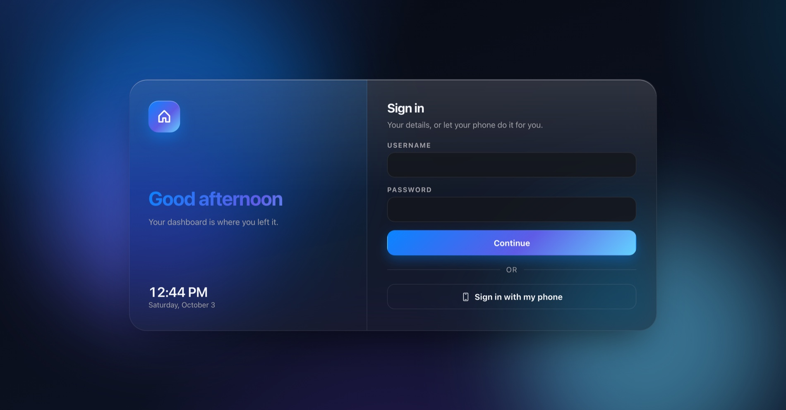

Signing in takes two steps. A correct password opens no session: it issues a
single-use challenge, valid five minutes, that grants nothing but the right to
present a second factor for that one account.

### Signing in with your phone

Typing a long password and six digits on a borrowed keyboard is the worst part
of a dashboard you only open now and then. **Sign in with my phone** shows a QR
code instead.

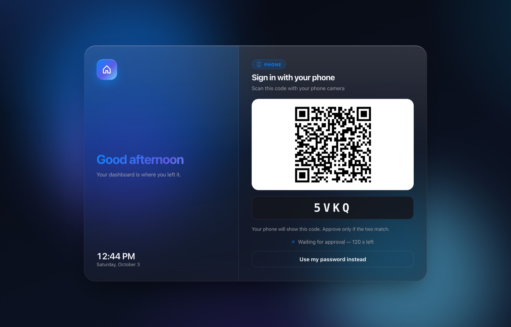

Scan it with the **camera app** — there is nothing to install and nothing to
open: the code is a link, and your phone follows it. A device that already
carries a session is then asked to approve, and it is told what it is approving
before anything is granted.

<p align="center">
  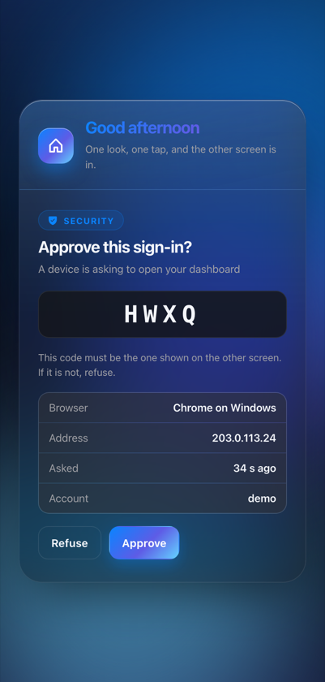
</p>

The waiting screen is never told the secret. It is handed a request id, in a
cookie of its own, which grants nothing but the right to wait; the power to
approve travels only inside the QR image. So watching the network, or reading
the access log of the proxy in front, buys nothing. Both screens show the same
four-character code, to be compared before approving — if they differ, you are
not looking at your own request. A request lasts two minutes and can be spent
once.

The second factor here is the session of the phone: only a device that signed in
with a password and a code can approve. On an iPhone, the camera opens the link
in Safari, which keeps its own cookies, separate from the installed app — so if
you have only ever signed in inside the app, Safari will ask you to sign in
once, and the page says so.

### Open sessions

A sign-in that can be granted with a camera is one worth being able to look at
afterwards. **Settings → Account** lists every device holding a session, how it
was opened, when it was last used, and ends any of them on one click.

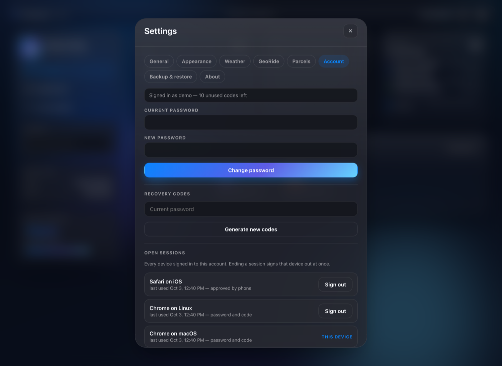

## Accounts

One instance, as many accounts as you like. **Each one has its own dashboard**:
its own shortcuts, tiles, wallpaper, revision history, parcels and mailbox
suggestions, and its own GeoRide session, 17TRACK key and mailbox password. Two
people on one instance follow two GeoRide accounts and two 17TRACK allowances,
and neither can read the other's — the routes take the account from the session
cookie and never from the request, so there is no way to name someone else's.

The one thing shared is the cache of answers from third parties, which is keyed
by coordinates and holds nothing personal.

### The administrator

**The first account ever created is the administrator.** The role can be handed
to anyone else afterwards, and taken back — with one rule the interface and the
API both enforce: the last administrator cannot step down or be deleted. An
instance with no administrator could never be administered again, and nothing
in the interface could undo it.

An administrator sees two extra tabs in the settings, **Accounts** and **Mail
server**. Everyone else sees neither, and every route behind them refuses a
standard account on its own — the hidden tabs are a courtesy, not the control.


### Adding someone

Two ways, in **Settings → Accounts**.

**Create the account outright.** You choose a username and a first password and
pass them on however you like. The person enrols their own second factor the
first time they sign in; nobody else can, and nobody else should.

**Send an invitation.** A single-use link, good for 48 hours, where the person
chooses their own password — so none ever passes through you. You can fix the
username in advance, or leave it to them.

Either way the account starts on the same neutral example dashboard a fresh
instance does.

An account can be deleted, which takes its dashboard, its stored credentials
and its parcels with it, through `ON DELETE CASCADE` and one file removal for
the wallpaper. Its sessions can also be ended without deleting anything, which
is what to press when someone's laptop goes missing.

### Sending invitations

The invitation link is **always shown to you**, whether or not a mail server is
set up: an instance with no SMTP works exactly as well, you carry the link over
yourself. Give an address and configure **Settings → Mail server**, and it is
also sent.

The mail server is used for invitations and nothing else. STARTTLS on port 587,
direct TLS on 465, or neither; the password is encrypted with `APP_SECRET` and
never shown again.

With Gmail, this needs an **application password**, exactly as the mailbox scan
does: turn on two-step verification, create a 16-character app password, and
use that. The account password is refused — Google answers `534 5.7.9
Application-specific password required`, which the panel translates into what
to do about it. The **Test** button checks what is on screen rather than
what is saved, which is the point of testing, and can send a message to an
address of your choice.

The SMTP client is written against RFC 5321, here rather than in a dependency,
for the same reason the IMAP reader is: four runtime dependencies is the budget,
and one message over a protocol this small does not justify a fifth.

### What an upgrade does to an existing instance

Nothing you have to do. On the first start after the upgrade, the single
account it already had becomes the administrator and keeps everything: its
dashboard, its revisions, its credentials, its parcels and its wallpaper. The
tables whose key had to be widened by the account are rebuilt in one
transaction, and the result is checked for dangling references before the
server accepts any traffic.

## Integrations

### Weather, Open-Meteo

No account, no API key. Two kinds of tile: one that follows the browser
geolocation (with a configurable fallback position) and one for a fixed city.
City names are resolved through OpenStreetMap Nominatim, server-side and
cached, so your visitors' IP addresses never reach it. Disable the whole
integration in **Settings → Weather** and both tiles disappear cleanly.

Each tile carries the day's sunrise and sunset under the wind and the rain.

Clicking one opens the detailed forecast: seven days to pick from, and for the
day you pick, one drawing of the whole day. The sun's course arcs over a
horizon, dotted ahead and solid for the part already run, with the sun itself
sitting where it is right now; the night stretches carry the moon and a few
stars. Below the horizon, the temperature runs as a line, the hours already
gone dimmed, with the day's lowest and highest marked where they happen, and
the chance of rain as bars along the bottom.

Move the pointer across it and the heading turns into a reading of the hour
under the cursor: the time, the sky, the temperature, what it feels like, the
chance of rain and the wind. It answers to a finger and to the keyboard too —
tab to it and the arrow keys walk the hours, Escape drops the reading.

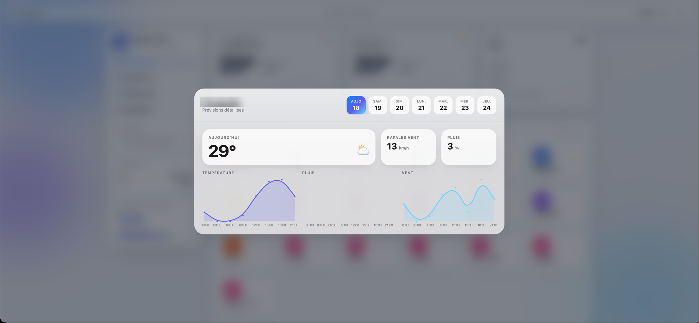

<sub>The screenshot above predates this drawing and will be retaken.</sub>

### GeoRide, motorcycle tracker

Sign in once in **Settings → GeoRide**. The credentials are encrypted with
`APP_SECRET` and stored in your data directory, and the returned token is
renewed automatically before it expires. The tile shows the distance, riding
time, number of trips and top speed over the period you choose, plus the
current position on a map.

Clicking the tile opens the rides of the period on an interactive map, with
every track drawn. Click one in the list and it comes forward, the others fade
out, the map frames it and marks where it started and ended; the four figures
then describe that ride rather than the whole period. The period itself
switches between 24 hours, 7 days and 30 days. Click outside the panel, or
press Escape, to close it.

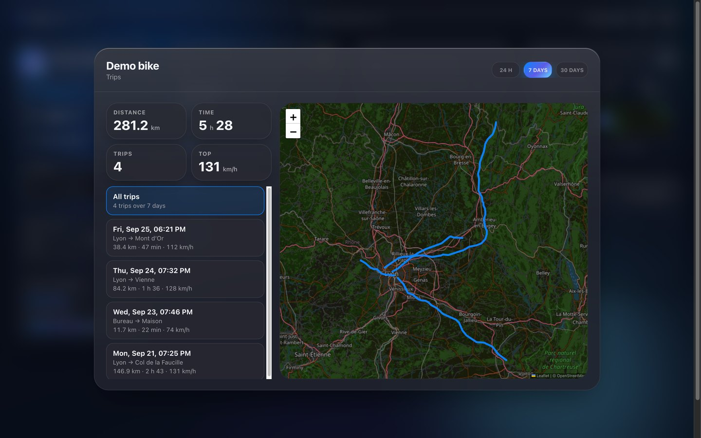

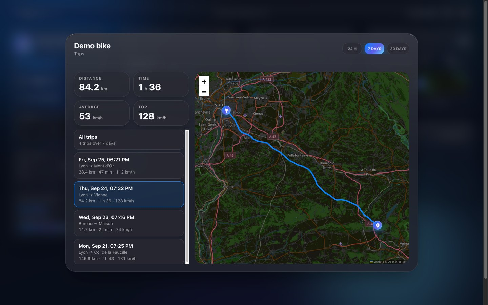

<sub>Fabricated rides: the screenshots come from a demo instance, not a real
account.</sub>

Endpoints used, from the official documentation at <https://api.georide.fr>:
`POST /user/login`, `GET /user/new-token`, `GET /user/trackers`,
`GET /tracker/:id/trips`, `GET /tracker/:id/trips/positions`. Speeds are
returned in knots and converted to km/h, distances are in metres.

**The last month of rides is kept on the server, not cached.** They are written
to the database as they are read, already thinned, and every later sync asks
GeoRide only for what has happened since the newest one on record. A month of
riding is tens of thousands of GPS positions — a dozen megabytes — and fetching
it again whenever a cache expired is what used to make opening the card feel
like loading a page. Now a page load that finds the month already there calls
GeoRide not at all, and one that finds it a few hours old fetches a few hours.
Only the very first ever, on a new instance, fetches the whole month.

A sync also skips the positions of a ride that ended more than a quarter of an
hour ago, since it will not gain another metre, and asks only for what came
after it: a parked motorcycle costs well under a kilobyte. Rides that fall out
of the retention window are dropped by the same sync, and by the hourly
housekeeping on an instance where GeoRide has since been switched off, so the
table stays the size of a month — about 8 kB a ride — whatever the mileage.

The panel therefore opens on data that is already there, and switching between
rides or periods costs nothing: the shorter periods are slices of the month in
hand, and picking a ride only restyles the tracks already on the map. The
dashboard asks for the month once, and again only when the tile says a ride has
arrived since. JSON responses are gzipped, which takes a month of tracks from
about 100 kB down to 35 kB on the wire. When GeoRide cannot be reached at all,
the stored month is served anyway and the card says it is behind.

Two details about the tracks, because the API decides them for us. The
positions endpoint returns the whole period in one list and never says which
trip a point belongs to, so each ride takes the points that fall inside its own
start and end times. And the trips endpoint carries an average speed but no
maximum, so the top speed of a ride is computed from those same points. A long
ride holds thousands of them; each track is thinned down to 400 points on the
server, keeping both ends, and the whole month is held to 12 000 points, which
leaves the shape of every ride intact and the map quick to draw. Coordinates are
rounded to five decimals, about a metre.

Map tiles come from OpenStreetMap through the server, and are cached on disk.
If you expect real traffic, point the proxy at your own tile server. See
[OSM's tile usage policy](https://operations.osmfoundation.org/policies/tiles/).

### Parcels, 17TRACK

The parcels tile lists what is on its way, coloured by state, and opens a view
with every step each parcel has been through.

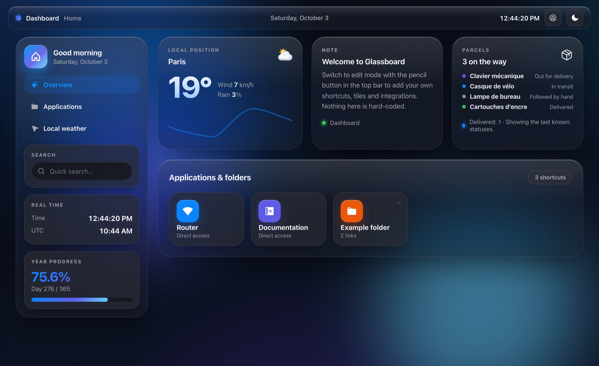

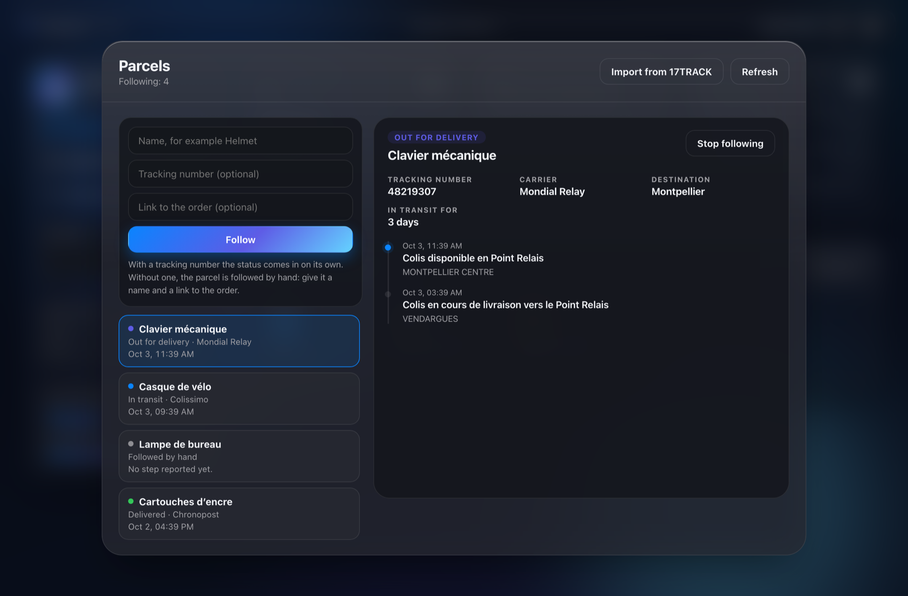

<sub>Invented parcels: the screenshots come from a demo instance. Those tracking
numbers lead nowhere.</sub>

#### Getting a 17TRACK key

The provider is [17TRACK](https://api.17track.net/en/doc), which recognises the
carrier on its own and covers the usual ones. Getting a key takes two minutes
and no payment method:

1. Create an **API account** at <https://api.17track.net> — this is the
   developer side of the service, separate from the 17track.net site and its
   mobile app, even though both read the same account.
2. Sign in, open **Settings** in that dashboard, and copy the security key.
3. Paste it into **Settings → Parcels** in Glassboard. It is stored encrypted
   with `APP_SECRET`, never leaves the server and is never shown again.

New accounts get a **one-time allowance of 200 tracking numbers**, which is
plenty for a household: a number is charged once, when it is first declared,
and then followed for free until it is delivered. The panel shows what is left.

A detail worth knowing, because it surprises: numbers you add **by hand on
17track.net** draw on that same allowance. It is one pool, not two.

That the credit is charged on **registration** and not on reading decides how
the whole integration behaves: a number is declared once, and reading statuses
is one batched request for the whole list, as often as you like. The provider
refreshes its own data every 6 to 12 hours, so asking more often gains nothing;
the default is every three hours. A parcel added moments ago is re-read sooner,
because the provider needs a short while before it has anything to say about a
number it has only just been given.

#### Three ways to follow a parcel

**With a tracking number.** Type it in and the number is declared to the
provider, which works the carrier out by itself. The status comes in on its own
from then on, and the detail view fills with the steps the parcel has been
through.

**By hand**, with a name and a link to the order, for anything no third party
can query. That is the case for an Amazon Logistics parcel, whose number starts
with `TBA`: it never enters a carrier's network, so it exists in no system
reachable from outside Amazon. Such a parcel shows up in the list with its link
and no automatic status, which is more honest than an empty timeline.

**By importing what the account already follows.** If you are used to typing
your numbers on 17track.net, **Import from 17TRACK** adopts the lot, carriers
and histories included, and leaves alone the ones already on the dashboard.
It costs nothing: those numbers are declared already, so the import only ever
reads, and you can press it as often as you like. Whatever remark or order
number you gave them over there becomes the parcel's name here.

A parcel that has been delivered leaves the list on its own after a few days,
which is what keeps the tile readable without any housekeeping.

#### Finding parcels in your mail

Typing a tracking number in by hand gets old. Glassboard can read your mailbox
and propose what it finds, in **Settings → Parcels**.

The scan **proposes, it never decides**. Every number it turns up appears as a
suggestion above the parcel list, with a **Follow** and an **Ignore** button.
That is the credit rule showing through the design: accepting a suggestion is
what registers a number and spends a credit, so a scanner that acted on its own
would empty the allowance on parcels nobody asked about. Because a human
confirms, the extraction can afford to be generous, and an ignored number is
remembered so it is not offered again.

This is also what makes Amazon work. A `TBA` number cannot be queried by anyone
but Amazon, but Amazon *writes to you*: shipped, out for delivery, delivered. So
those parcels are followed by hand and their state is moved along by the mails
themselves, without a single credit being spent. A carrier feed always wins over
a sentence in a subject line: a parcel the provider reports on is never moved
this way.

Set-up, with Gmail: turn on two-step verification, create a **16-character app
password**, and give Glassboard your address and that password. Your account
password will not work, and Outlook or Microsoft 365 mailboxes cannot be used
this way at all: Microsoft turned off password-based IMAP for them in 2024.

The mailbox is opened **read-only**, with `EXAMINE` rather than `SELECT` and
`BODY.PEEK` rather than `BODY`. The server itself refuses any write, so a bug
here cannot mark a message as read, move it or delete it. Nothing of a mail is
kept: only the tracking number and the subject line of the message it came from.

Two things worth knowing before you turn it on. An IMAP password grants read
access to the **whole** mailbox; restricting the scan to certain senders limits
what the scanner looks at, not what the credential would allow. And the app
password is stored encrypted with `APP_SECRET`, so it is exactly as safe as that
secret and as the machine holding it. Use a dedicated app password, revocable on
its own without touching your account.

### Adding your own

A tile type is one entry in `TILE_TYPES` (`server/config-schema.js`), one
renderer in `public/assets/app.js`, and, if it talks to an API, one module in
`server/integrations/`. The configuration document carries its settings. No
other part of the system needs to know about it.

## Backup and restore

From the interface: account menu → **Export configuration** / **Import
configuration**, or **Settings → Backup & restore**.

From the command line:

```bash
npm run config:export -- --out backup.json
npm run config:export -- --user alice --out backup.json
npm run config:export -- --out backup.json --include-secrets
npm run config:import -- backup.json --user alice
```

`--user` names the account to export or import. It is optional while the
instance has one account and **required** once it has several: picking the
first one silently would mean exporting, or worse overwriting, the wrong
person's dashboard. Without it, the script lists the accounts and stops.

In Docker:

```bash
docker compose exec glassboard node scripts/config-export.mjs --stdout > backup.json
```

Secrets are **excluded by default**. With `--include-secrets` the file contains
your integration credentials in plain text, carries a `WARNING` field, and is
written with `0600` permissions. Treat it like a password file.

Every import writes a snapshot of the current configuration to
`$DATA_DIR/backups/` first, validates the whole file, and only then replaces
anything. An invalid file is refused with a precise error and changes nothing.

The format is versioned and documented in
[docs/configuration-format.md](docs/configuration-format.md).

## Behind a reverse proxy

```nginx
server {
    listen 443 ssl;
    server_name dashboard.example.org;

    location / {
        proxy_pass http://127.0.0.1:3000;
        proxy_set_header Host              $host;
        proxy_set_header X-Real-IP         $remote_addr;
        proxy_set_header X-Forwarded-For   $proxy_add_x_forwarded_for;
        proxy_set_header X-Forwarded-Proto $scheme;
    }
}
```

Set `TRUST_PROXY=1` so the lockout counts real client addresses.

Glassboard itself has no IP allow list: its own sign-in is the gate. If you put
one in the proxy, remember that a browser fetches the web manifest without
credentials, which is why the manifest link carries `crossorigin`.

## Configuration reference

Every setting is an environment variable, read from the process environment or
from a `.env` file next to the server. See [.env.example](.env.example).

| Variable | Default | Purpose |
|---|---|---|
| `APP_SECRET` | none | **Required in production.** Signs sessions and encrypts stored credentials. Changing it invalidates both. |
| `PORT` | `3000` | HTTP port. |
| `HOST` | `127.0.0.1` | Bind address. Use `0.0.0.0` in a container. |
| `DATA_DIR` | `./data` | Where the database, backups and the tile cache live. |
| `TRUST_PROXY` | `0` | Set to `1` behind a reverse proxy so client IPs and the HTTPS flag come from `X-Forwarded-*`. |
| `COOKIE_SECURE` | `auto` | `auto` marks the session cookie `Secure` only on HTTPS requests. Force with `true` / `false`. |
| `SESSION_TTL_HOURS` | `720` | Session lifetime. |
| `LOGIN_MAX_ATTEMPTS` | `5` | Failed logins before a lockout. |
| `LOGIN_LOCKOUT_MINUTES` | `15` | Lockout duration. |
| `OSM_CONTACT` | none | Optional contact address sent to OpenStreetMap services, as their usage policy asks. |
| `UPDATE_ENABLED` | `0` | `1` turns on the **Update now** button. Needs the updater from [deploy/](deploy/README.md). |
| `UPDATE_REPO` | `Lokyron/GlassBoard` | The GitHub repository updates come from. |
| `UPDATE_BRANCH` | `main` | The branch the stable channel installs. |
| `UPDATE_BETA_BRANCH` | `beta` | The branch the beta channel installs. Empty offers the stable channel only. |
| `UPDATE_CHECK_HOURS` | `24` | How often the instance asks GitHub whether a newer version exists. |

## Security

- Passwords are hashed with argon2id. TOTP secrets and integration credentials
  are encrypted with AES-256-GCM.
- Session cookies are `HttpOnly`, `SameSite=Lax`, and `Secure` over HTTPS.
- Signing in takes two steps. A correct password opens no session: it issues a
  single-use challenge, valid five minutes, that grants nothing but the right to
  present a second factor for that one account. Both steps share the same
  lockout counter, so the code step cannot be brute-forced either.
- Every page and every API route requires a session, except the login screen,
  the first-run setup screen and the approval page — which is served to anyone
  but shows nothing at all until the device looking at it is itself signed in.
- A sign-in approved from a phone never puts the deciding secret on the wire:
  the waiting browser holds a request id, in an `HttpOnly` cookie rather than in
  the URL it polls, so the id reaches no access log; the secret that approves
  exists only inside the QR image. A request lasts two minutes, is spent once,
  and can only be approved by a device that itself signed in with a password and
  a code. Every session is listed in the settings and can be ended from there.
- Accounts are isolated by the session and nothing else: every route reads the
  account from the session cookie and never from the request, so there is no
  parameter anywhere that names a dashboard, a parcel or a credential belonging
  to someone else. A revision id from another account reads as unknown rather
  than as forbidden, which says nothing about whether it exists.
- Administration is a role on the account, checked server-side on every route
  under `/api/admin`. Hiding the tabs from everyone else is a courtesy; the
  refusal is the control. The last administrator cannot step down or be
  deleted.
- An invitation stores only the hash of its token, like a password. The token
  itself exists in the link and nowhere else, and travels in the URL fragment,
  which browsers never put on the wire — so it reaches no access log and no
  proxy. Single use, 48 hours, and marked spent before the account is created
  so two people racing the same link cannot both get in.
- Shortcut URLs are restricted to `http:` and `https:`, in the browser and on
  the server, so an imported file cannot inject a `javascript:` link.
- Losing `APP_SECRET` means losing the sessions and the stored credentials. The
  dashboard configuration itself stays readable.

Found a hole? Please report it privately: see [SECURITY.md](SECURITY.md).

## How it works

```
glassboard/
├── server/            HTTP server, storage, auth, integrations
├── public/            the dashboard itself (HTML/CSS/JS, no build)
├── scripts/           export and import CLI
├── deploy/            updater script and systemd units
├── docs/              format documentation
└── $DATA_DIR/         YOUR data, never in git
    ├── glassboard.db  configurations, accounts, encrypted credentials
    ├── backups/       automatic snapshots taken before imports
    ├── wallpaper-<n>.bin  one per account that uploaded one
    └── tiles/         cached map tiles
```

The server is plain Express 5 on Node 24, storing everything in one SQLite file
through the built-in `node:sqlite`. The front end is hand-written HTML, CSS and
JavaScript: no framework, no bundler, no build step, and the only two vendored
libraries are Leaflet and the Phosphor icon set. The whole configuration is a
single versioned JSON document, validated on the way in and kept for 20
revisions, which is what makes export, import and rollback so simple.

An hourly job keeps the footprint flat without any attention: it drops expired
cache rows and caps the table, deletes expired sessions and sign-in challenges,
trims the map tile cache back under 128 MB by dropping the least recently used,
folds SQLite's write-ahead log back into the database and refreshes its
statistics.

In the browser, the clock and the polling stop while the tab is hidden and pick
up again when it comes back. A dashboard left open on a phone all day should
not cost battery.

The architecture notes, in French, are in
[docs/architecture.fr.md](docs/architecture.fr.md).

## Contributing

Issues and pull requests are welcome. [CONTRIBUTING.md](CONTRIBUTING.md) covers
how to run it locally, what the code style is, and how to add a tile type, a
theme or a language. Please do not paste your own URLs, tokens or addresses into
an issue.

## Credits

- [Phosphor Icons](https://phosphoricons.com) (MIT), inlined SVG icons
- [Leaflet](https://leafletjs.com) (BSD-2-Clause), map rendering
- [Open-Meteo](https://open-meteo.com), weather forecasts
- [OpenStreetMap](https://www.openstreetmap.org/copyright), map tiles and
  reverse geocoding
- [GeoRide](https://georide.fr), tracker API
- [17TRACK](https://www.17track.net), parcel tracking API

## License

MIT, see [LICENSE](LICENSE). Copyright holders are the Glassboard contributors.
